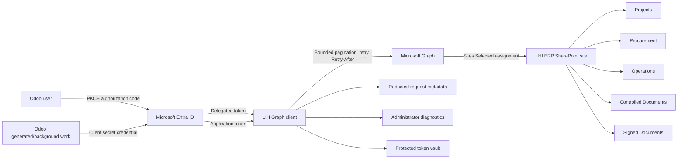

# LHI Microsoft Graph Core

`lhi_microsoft_graph_core` is the reusable Microsoft Graph and SharePoint
connection foundation for LHI ERP on Odoo 19 Community.

This sprint does not move document bytes, replace `ir.attachment`, introduce a
document workspace UI, or synchronize Entra organizational data. Those concerns
remain assigned to the later `lhi_sharepoint_storage`,
`lhi_document_workspace`, `lhi_sharepoint_sync`,
`lhi_entra_identity_sync`, and `lhi_document_migration` modules.

## Architecture

Authorization remains in Odoo. Entra authenticates users and supplies identity
attributes in later sprints; it does not replace LHI groups, record rules,
approval matrices, project assignments, segregation-of-duties controls, or
protected administrator roles.

## Authorization contexts

- Application access uses the OAuth 2.0 client-credentials flow with
  `ENTRA_TENANT_ID`, `ENTRA_CLIENT_ID`, and `ENTRA_CLIENT_SECRET` supplied only
  through protected runtime environment settings.
- Delegated access uses the authorization-code flow with PKCE and an expiring,
  database-bound, user-bound signed state value.
- Both contexts are restricted to `Sites.Selected`. Broad delegated
  `Files.*.All` and `Sites.*.All` scopes are rejected by model constraints.
- A selected permission is not effective until Entra consent and an explicit
  permission assignment to the approved SharePoint site both exist.

## Reliability and security controls

- protected persistent token cache with expiry skew;
- refresh-token renewal for delegated sessions;
- bounded pagination that follows the complete opaque `@odata.nextLink`;
- network, HTTP 429, and HTTP 5xx retries with exponential backoff and jitter;
- `Retry-After` support with an administrator-controlled upper bound;
- one forced token refresh after an HTTP 401;
- HTTPS and `graph.microsoft.com` enforcement for absolute next links;
- structured request metadata without headers, tokens, credentials, or payloads;
- secret and token pattern redaction in safe error text;
- multi-company record rules;
- no ACLs for token and OAuth-state models;
- validated SharePoint site, drive, and root item IDs are read-only and can only
  be written by successful Graph validation actions;
- candidate Drive IDs are accepted only if they appear in the validated site's
  drive collection;
- production delegated redirects are fixed to
  `https://work.lhinigeria.org/lhi/microsoft_graph/oauth/callback`;
- application client secrets are never stored in Odoo, returned by configuration
  APIs, sent to browser JavaScript, or included in authorization URLs.

## Administration

See:

- [Administrator guide](docs/administrator_guide.md)
- [Entra and SharePoint security configuration](docs/entra_sharepoint_configuration.md)
- [Coolify deployment and rollback](docs/deployment_and_rollback.md)
- [Sprint delivery summary](delivery_summary.md)

Provisioning assets are in `provisioning/`.
