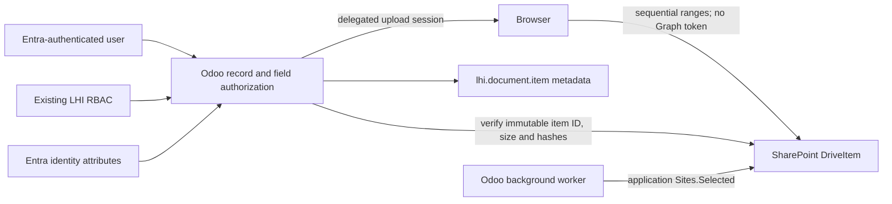
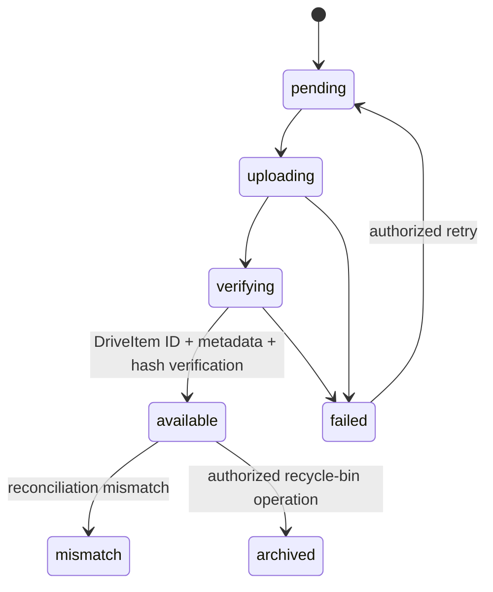

# Security and storage architecture

## Authority boundaries

- Microsoft Entra ID authenticates people and supplies identity attributes.
- Existing LHI Odoo groups, record rules, project assignments, approval
  matrices, segregation-of-duties controls, and protected administrator roles
  remain the authorization engine.
- SharePoint applies a second permission check for delegated user downloads and
  user-driven direct uploads.
- Application access is reserved for Odoo-generated files, background retry,
  e-mail processing, reconciliation, and controlled integration work.
- No `lhi_entra_rbac` module is created.

## Fail-closed state machine

An `ir.attachment` compatibility record may exist while its document is
`pending` or `failed`, but it contains no permanent business-file bytes and does
not claim the file is available. The retry payload is held only in the
restricted spool directory. Successful spool deletion occurs after the Odoo
transaction commits.

## Storage policy

Business storage is opt-in by model and optionally by field. Policies define:

- library role;
- folder strategy;
- file-size limit;
- allowed extensions;
- resumable chunk size;
- conflict behavior;
- required SharePoint metadata;
- document class, confidentiality, and retention category; and
- whether delegated browser upload is enabled.

The following remain on Odoo's standard technical storage unless a separately
tested policy is approved:

- frontend assets and asset bundles;
- company logos, user avatars, contact images, and website media;
- QWeb/static rendering resources;
- mail-template resources;
- temporary report renderer resources;
- migration/import source files such as `lhi.migration.tooling.source_file`;
- session, cache, and framework attachments; and
- attachments on models with no active SharePoint policy.

No global `_storage()` replacement or Odoo core patch is used.

## Upload paths

### User-driven direct upload

1. Odoo checks write access to the linked business record and attachment field.
2. Odoo resolves and validates the active storage policy.
3. Odoo uses the user's delegated token to create the folder and upload session.
4. The browser receives only the short-lived preauthenticated upload URL.
5. The browser uploads sequential ranges without receiving a reusable Graph
   token.
6. Odoo re-reads the DriveItem using delegated Graph access, validates its drive,
   parent, size, and immutable item ID, streams it once to calculate trusted
   SHA-256/SHA-1 hashes, writes SharePoint columns, and verifies it again.
7. Only then does Odoo create the byte-free compatibility attachment and mark
   the document available.

### Odoo-generated or compatibility upload

1. Content is generated in memory or received through an existing attachment
   route.
2. Odoo calculates SHA-256 and SHA-1.
3. Content moves to the restricted processing spool before local attachment
   bytes are cleared.
4. Small files use direct content upload. Larger files use resumable sequential
   fragments in policy-sized multiples of 320 KiB.
5. Interrupted sessions retain `nextExpectedRanges` progress and are retried by
   the existing integration queue.
6. SharePoint metadata and the DriveItem are verified before `available`.
7. The spool path is cleared transactionally and the file is securely removed
   after commit.

## Download and deletion

- The standard `/web/content` attachment path resolves to an authenticated LHI
  controller.
- Odoo checks access to the linked business record and field.
- Interactive downloads use delegated Graph access, so both Odoo and SharePoint
  authorization must succeed.
- The browser is redirected only to Microsoft's short-lived preauthenticated
  download URL.
- Background reads explicitly use application context.
- Deletion uses DriveItem ID and `If-Match` when an ETag is available, moving the
  item to the SharePoint recycle bin. Odoo metadata is archived rather than
  silently destroyed.

## SharePoint metadata columns

The module writes the columns provisioned by `lhi_microsoft_graph_core`:

- `LhiOdooDatabase`
- `LhiOdooModel`
- `LhiOdooRecordId`
- `LhiCompanyCode`
- `LhiDocumentClass`
- `LhiWorkflowState`
- `LhiContentSha256`
- `LhiAuditCorrelationId`
- `LhiRetentionCategory`

Unknown policy metadata may be added only after the corresponding SharePoint
column is provisioned and validated.

