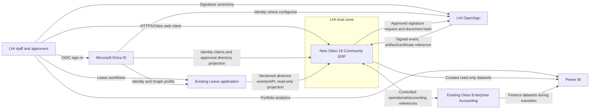
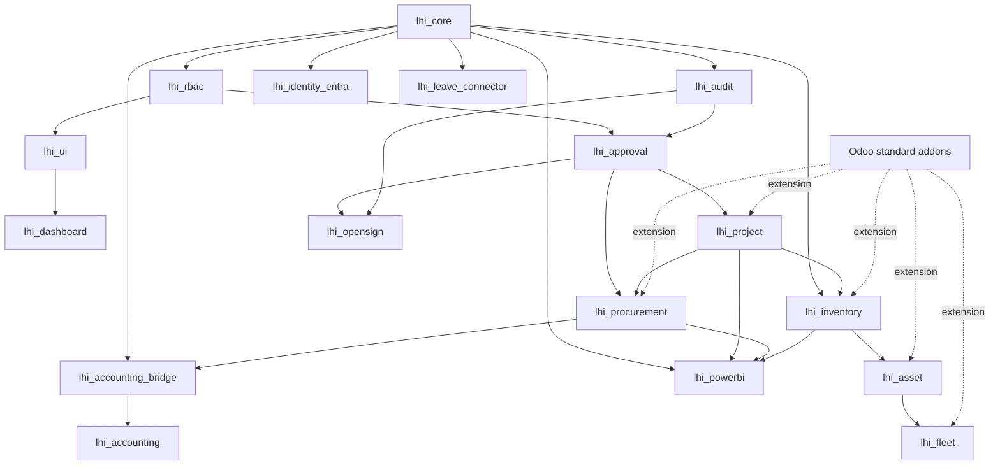

# 3. Technical Architecture

## System-context diagram

## Proposed `lhi-addons` layout

Physical directory: `custom-addons/`. Logical suite name: `lhi-addons`.

| Addon | Depends on | Responsibility |
|---|---|---|
| `lhi_core` | `base`, `mail`, `web`, `contacts`, `hr` | Shared external IDs, feature flags, business dimensions, common mixins, configuration and base security categories |
| `lhi_identity_entra` | `lhi_core`, `auth_oauth` | Entra provider hardening, identity mapping, controlled provisioning/deprovisioning and role synchronization |
| `lhi_rbac` | `lhi_core` | LHI business groups, role assignment governance, access review and cross-module security helpers |
| `lhi_audit` | `lhi_core` | Append-oriented sensitive-event log, integration event evidence, retention/export hooks |
| `lhi_approval` | `lhi_core`, `lhi_rbac`, `lhi_audit` | Reusable approval policy/version, request, step, delegation, escalation and server-side transition service |
| `lhi_ui` | `lhi_core`, `lhi_rbac`, `web` | UI shell, namespaced Owl services/registries, navigation and shared visual components |
| `lhi_dashboard` | `lhi_ui`, relevant operational addons | Role-aware operational KPI/exception client action; no independent source-of-truth data |
| `lhi_project` | `lhi_approval`, `crm`, `sale_project`, `project` | Opportunity handoff, project governance, milestones, risks/issues, stage gates and closeout |
| `lhi_procurement` | `lhi_approval`, `purchase`, `purchase_stock`, `lhi_project` | Purchase requests, sourcing/evaluation evidence, thresholds, approvals and project links |
| `lhi_inventory` | `lhi_core`, `stock`, `project_stock` | LHI warehouse/site controls, project issues/returns, traceability and count approvals |
| `lhi_asset` | `lhi_inventory`, `maintenance` | Operational equipment registry, tags, custody, transfer, maintenance and retirement proposal |
| `lhi_fleet` | `lhi_asset`, `fleet` | Vehicle/custody extensions, service controls and project/site linkage |
| `lhi_leave_connector` | `lhi_core`, `hr` | Read-only external Leave projection, sync events/status and availability links; no leave workflow |
| `lhi_opensign` | `lhi_approval`, `lhi_audit` | Signature requests, eligible-document adapters, verified inbound events and artifact evidence |
| `lhi_powerbi` | `lhi_core`, operational addons | Versioned read-only export views/API, refresh watermark and data-quality contract |
| `lhi_accounting_bridge` | `lhi_core`, `purchase`, `account` | Disabled-by-default Enterprise Accounting references/reconciliation interface |
| `lhi_accounting` | `lhi_accounting_bridge` | Dormant future accounting extensions; every entry point guarded by formal feature flag |

Keep business adapters separate when dependencies would otherwise spread: for example `lhi_opensign_project` or `lhi_opensign_procurement` may depend on both domains while the base connector remains neutral.

## Module dependency map

Rules: no circular dependencies; integration base addons do not depend on every business domain; adapters own cross-domain dependencies; uninstall/upgrade behavior must be tested.

## Security boundaries

| Boundary | Required controls |
|---|---|
| Browser ↔ Odoo | HTTPS, Entra SSO, secure session cookies, CSRF on state changes, CSP/security headers, server-side group/record checks |
| Entra ↔ Odoo | OIDC metadata/keys, exact tenant/issuer/audience validation, immutable `oid`, group allowlist, disabled-user handling, least-privilege Graph scopes |
| Odoo internal ORM | Dedicated groups, restrictive ACLs, company/team/owner rules, transition methods, field groups, constrained/scoped `sudo()` |
| Odoo ↔ Leave | Dedicated service identity, versioned schema, TLS, least-privilege read/event scope, idempotency, cursor/reconciliation, PII minimization |
| Odoo ↔ OpenSign | Authenticated outbound API, signed inbound events, nonce/timestamp/replay defense, allowlists, queued retry, artifact verification |
| Odoo ↔ Enterprise Accounting | Feature gate, service identity, approved record types, reconciliation totals, idempotency, dead-letter review, no posting before cutover |
| Odoo → Power BI | Read-only curated contract, service principal, network restriction, dataset/row security, refresh audit, no Odoo write-back |
| Administrators | Separate business/config/technical roles, MFA via Entra, break-glass process, privileged-action audit and periodic review |

### Initial RBAC model

Role families: employee/requester, project member, project manager, procurement officer, procurement approver, store user, inventory manager, asset custodian, asset manager, fleet officer, fleet manager, HR integration viewer, signature operator, auditor/read-only, BI service, integration service, business configuration administrator and tightly controlled technical administrator.

RBAC decisions must be expressed as an access matrix per model/action and then implemented through groups, ACLs, record rules and server methods. Menu visibility follows authorization but never replaces it. Multi-company domains use the user's allowed `company_ids`; destructive rights are exceptional.

## API and event boundaries

### Common integration envelope

Every asynchronous event should carry: `event_id`, `event_type`, `schema_version`, `occurred_at`, `source_system`, `aggregate_type`, `aggregate_id`, `aggregate_version`, `correlation_id` and integrity/authentication metadata. Odoo stores processing status, attempt count, last error category, timestamps and payload hash—not secrets.

### Leave

- Inbound types: absence approved, changed, cancelled; optional daily reconciliation snapshot.
- Odoo exposes no balance/approval mutation endpoint.
- Conflict owner: Leave application. Identity join: Entra `oid`.

### OpenSign

- Outbound: create request from an allowlisted document adapter, signers, document hash, callback correlation ID.
- Inbound: created/progress/completed/declined/expired with monotonic event identity.
- Completion triggers authenticated artifact retrieval and verification; it never trusts arbitrary `res_model`, `res_id`, callback URL or download URL.

### Enterprise Accounting

- Before migration: only approved master/reference/status exchanges; direction and fields require Finance sign-off.
- All mutation paths fail closed while `lhi_accounting_enabled` is false.
- Reconciliation includes counts and monetary totals by company, currency, date and interface batch.

### Power BI

- Prefer a curated analytics store/read replica populated from versioned Odoo extracts. If unavailable initially, use a narrowly scoped read-only API or database role against approved views.
- Never query transactional tables with a writable credential or expose chatter/private employee fields by default.

## Non-functional architecture targets to confirm

| Quality | Initial target requiring approval |
|---|---|
| Availability | Business-hours operational target and support SLA: TBD |
| RPO/RTO | Set by business impact analysis; restore test required before go-live |
| Performance | Interactive pages p95 and batch windows to be baselined with representative volume |
| Integration | At-least-once delivery tolerated through idempotent consumers; visible retry/dead-letter queues |
| Audit/retention | Retention by record class and Nigerian/LHI policy: TBD; timestamps UTC with local display |
| Privacy | Data minimization, purpose limitation, access review and documented exports |
| Observability | Structured logs, correlation IDs, metrics for queue age/failure and actionable alerts |

