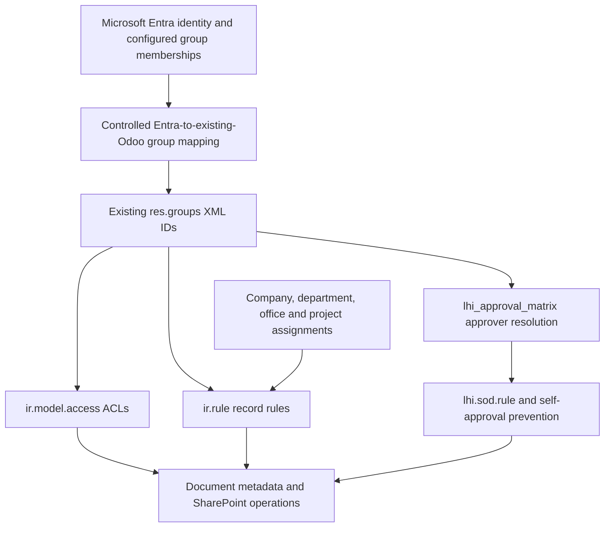
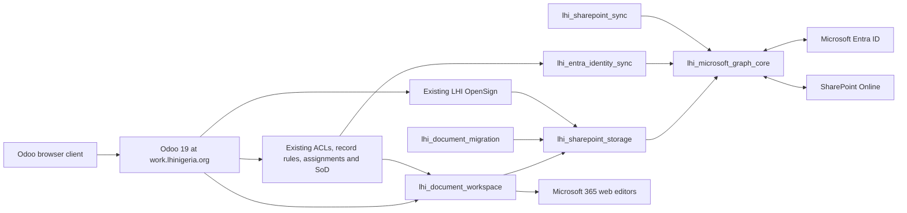

# Modification Sprint 1 — Existing-System Audit and Integration Architecture

Date: 2026-07-16  
Target: Odoo 19 Community  
Production URL: `https://work.lhinigeria.org`  
Scope: Read-only compatibility and architecture audit. No production data was modified.

## 1. Executive decision

The SharePoint and Entra work can be added without replacing the current LHI authorization or approval architecture, provided implementation extends the existing `lhi_integration`, `lhi_security`, `lhi_approval_matrix`, and `lhi_signature_bridge` contracts.

The six proposed module names are confirmed:

1. `lhi_microsoft_graph_core`
2. `lhi_sharepoint_storage`
3. `lhi_document_workspace`
4. `lhi_sharepoint_sync`
5. `lhi_entra_identity_sync`
6. `lhi_document_migration`

`lhi_entra_rbac` must not be created. Entra group membership is an identity input mapped to existing Odoo groups; Odoo remains the authorization engine.

Implementation must not globally redirect every `ir.attachment` to SharePoint. Business documents must use SharePoint, while technical attachments required by Odoo remain in the Odoo filestore.

## 2. Audit boundaries and evidence

Reviewed:

- all 49 `custom-addons/lhi_*` manifests;
- all custom Python, XML, CSV security, controller, JavaScript, test, and delivery-summary files;
- workspace Dockerfiles, Compose files, `odoo.conf`, environment-variable names, backup script, and development guidance;
- the running local development database using read-only SQL;
- existing Odoo 19 source modules relevant to OAuth, OpenSign, attachments, cloud storage, mail, reports, and web delivery.

Not available:

- Coolify UI configuration and generated Traefik labels;
- production Compose rendering and production environment-variable values;
- production database module state, attachment counts, user/group assignments, or filestore;
- production backup provider, schedule, retention, encryption, restore evidence, CPU, and memory sizing;
- Entra tenant configuration, app registrations, conditional-access policies, group inventory, and Graph consent;
- SharePoint tenant, site, library, retention, sensitivity-label, and permission configuration;
- live OpenSign tenant/API behavior.

These production items require an operator evidence capture before implementation approval. Source-code findings must not be treated as proof of production state.

## 3. LHI module inventory

All 49 source modules are Odoo `19.0.1.0.0` and marked installable.

| Module | Principal responsibility | Relevant dependency or integration |
|---|---|---|
| `lhi_accounting_base` | Dormant Accounting gate | `account`, `lhi_base` |
| `lhi_advance_accounting` | Staff advances | Accounting gate |
| `lhi_approval_matrix` | Approval matrices, delegations, SoD | `lhi_security`, `lhi_audit` |
| `lhi_asset_management` | Asset custody and transfers | PO and approvals |
| `lhi_audit` | Central audit events | Security |
| `lhi_base` | Offices, departments, projects, awards, master data | Base and mail |
| `lhi_budget_control` | Budget controls | Dormant Accounting |
| `lhi_dashboard` | Role-filtered dashboard | Security and approvals |
| `lhi_donor_management` | Donor profiles | Base and contacts |
| `lhi_feature_control` | Feature flags | Audit |
| `lhi_feature_control_account` | Accounting feature bridge | Feature control |
| `lhi_field_cash` | Field cashbooks | Dormant Accounting |
| `lhi_fleet_operations` | Trips, vehicles, incidents | Projects and approvals |
| `lhi_funding_opportunity` | Opportunity pipeline | Donors and approvals |
| `lhi_grant_accounting` | Grant accounting sandbox | Dormant Accounting |
| `lhi_grant_award` | Grant award extension | Signed agreement attachment |
| `lhi_integrated_tests` | Cross-module readiness tests | Operational modules |
| `lhi_integration` | Existing Entra/OAuth and integration queue foundation | Security, HR, OAuth |
| `lhi_inventory` | Stock operations | PO |
| `lhi_leave_bridge` | Existing Leave integration and unified inbox | Entra object ID |
| `lhi_legacy_accounting_bridge` | Enterprise Accounting handoff | PO |
| `lhi_meal` | MEAL data and evidence | Evidence attachments |
| `lhi_migration_tooling` | Accounting import tooling | Upload binary |
| `lhi_multi_currency` | Currency handling | Dormant Accounting |
| `lhi_ng_edi` | Nigerian e-invoicing adapter | Dormant Accounting |
| `lhi_ng_hr_payroll` | Payroll sandbox | Dormant Accounting |
| `lhi_partner_management` | Partners and subawards | Base |
| `lhi_powerbi` | Embedded Power BI | Entra identity |
| `lhi_procurement` | Sourcing, bids, evaluation | PR and vendors |
| `lhi_procurement_commitment` | Operational budget commitments | PR |
| `lhi_project_amendment` | Amendments | Amended-document attachments |
| `lhi_project_closeout` | Closeout | Project lifecycle |
| `lhi_project_compliance` | Activation and reporting calendar | Report attachments |
| `lhi_project_issue` | Issues and closure evidence | Evidence attachments |
| `lhi_project_lifecycle` | Project lifecycle | Compliance and Odoo Project |
| `lhi_project_reporting` | Project reports | Report attachments |
| `lhi_project_risk` | Risk register | Project lifecycle |
| `lhi_project_workplan` | Workplans and activities | Project lifecycle |
| `lhi_proposal_budget` | Proposal budgets and immutable submission snapshots | Binary/attachment snapshots |
| `lhi_proposal_management` | Proposal workspaces, sections, annexes | Attachments and approvals |
| `lhi_purchase_order` | PO and receipts | Procurement |
| `lhi_purchase_request` | Purchase requests | Attachments and approvals |
| `lhi_reporting_hub` | Reporting jobs and data quality | Power BI |
| `lhi_results_framework` | Results and indicators | Projects/workplans |
| `lhi_security` | Authoritative LHI groups and record scope | Base |
| `lhi_signature_bridge` | Existing OpenSign workflow | PO and signed binaries |
| `lhi_vendor_management` | Vendor onboarding | Vendor documents |
| `lhi_web_shell` | Odoo web shell and theme | Security |
| `lhi_withholding_tax` | WHT certificates | Remittance-evidence binary |

Local database observation: only `lhi_base`, `lhi_security`, `lhi_audit`, `lhi_approval_matrix`, `lhi_feature_control`, and `lhi_feature_control_account` were installed in the audited development database. `lhi_dashboard` and `lhi_web_shell` were registered but uninstalled. Production installation state remains unverified.

## 4. Security and RBAC inventory

### 4.1 Authoritative LHI groups

| XML ID | Role | Implies |
|---|---|---|
| `lhi_security.group_lhi_user` | User | `base.group_user` |
| `lhi_security.group_lhi_manager` | Manager | LHI User |
| `lhi_security.group_lhi_employee` | LHI Employee | LHI User |
| `lhi_security.group_lhi_supervisor` | LHI Supervisor | LHI Employee |
| `lhi_security.group_lhi_project_officer` | Project Officer | LHI Employee |
| `lhi_security.group_lhi_project_manager` | Project Manager | Project Officer |
| `lhi_security.group_lhi_programme_director` | Programme Director | Project Manager |
| `lhi_security.group_lhi_meal_officer` | MEAL Officer | LHI Employee |
| `lhi_security.group_lhi_procurement_officer` | Procurement Officer | LHI Employee |
| `lhi_security.group_lhi_procurement_manager` | Procurement Manager | Procurement Officer |
| `lhi_security.group_lhi_store_officer` | Store Officer | LHI Employee |
| `lhi_security.group_lhi_fleet_officer` | Fleet Officer | LHI Employee |
| `lhi_security.group_lhi_finance_reviewer` | Finance Reviewer | LHI Employee |
| `lhi_security.group_lhi_hr_officer` | HR Officer | LHI Employee |
| `lhi_security.group_lhi_internal_auditor` | Internal Auditor | LHI Employee |
| `lhi_security.group_lhi_executive_approver` | Executive Approver | LHI Employee |
| `lhi_security.group_lhi_erp_admin` | ERP Administrator | LHI Manager |
| `lhi_security.group_lhi_integration_service` | Integration Service Account | LHI Employee |

Additional existing groups:

- `lhi_meal.group_lhi_meal_sensitive`
- `lhi_accounting_base.group_lhi_accounting_sandbox`

No new business-role groups are required by the six proposed modules. New modules may define narrowly scoped technical administration groups only where existing ERP Admin and Integration Service groups cannot safely express the privilege.

### 4.2 Record rules

The source contains 55 custom record rules and 188 ACL entries.

The authoritative `lhi_security` rules are:

- ten global multi-company rules for office, department, programme, sector, donor, funding source, award, project, cost center, and activity;
- employee department restriction plus manager bypass;
- employee project-assignment restriction plus manager bypass;
- employee office restriction plus manager bypass.

Additional module rules cover assets, fleet, funding opportunities, integration administration, unified inbox ownership, MEAL sensitivity, partner subawards, sourcing/bids, commitments, amendments, closeout, compliance calendars, project issues/reports/risks/workplans, proposal budgets/submissions/workspaces, purchase orders/receipts/requests, results-framework records, vendors, announcements, and dashboard widgets.

The exact rule and ACL definitions remain in each module's `security/` directory and are not to be copied into the new modules. Document access must call the source record's normal access checks and record rules before issuing preview, download, edit, migration, or sharing operations.

### 4.3 Existing RBAC dependency diagram



Entra does not make the final authorization decision. Mapping changes must be validated against active `lhi.sod.rule` pairs before group assignments are applied.

## 5. Manager and organizational resolution

Existing structures:

- `lhi.department.manager_id` points to `res.users`;
- `hr.employee.parent_id` is the standard employee-manager relationship;
- approval matrices use `approver_group_id` and optional explicit `approver_ids`;
- approval requests snapshot eligible approvers from existing Odoo groups;
- delegations and escalation users are explicit Odoo users;
- purchase requests carry department, office, project, award, donor, and funding-source criteria;
- user scope is stored in `lhi_department_ids`, `lhi_office_ids`, and `lhi_project_ids`.

Architecture decision:

- Entra manager data updates `hr.employee.parent_id` after cycle, existence, and company checks.
- Where approved by configuration, the employee manager's linked user can update `lhi.department.manager_id`; it must not rewrite approval matrices.
- Entra departments and offices map to existing `lhi.department` and `lhi.office` records through explicit immutable mapping records. Identity synchronization must not silently create duplicate organizational records.
- Project assignments remain Odoo-managed and must not be inferred from Entra unless a later approved mapping explicitly defines that behavior.

## 6. Existing Microsoft authentication and identity

Existing implementation:

- `lhi_integration.data/auth_oauth_data.xml` creates `lhi_integration.provider_microsoft_entra`;
- provider endpoint uses the Microsoft common tenant endpoint;
- scope is `openid profile email User.Read`;
- validation/data endpoint is Microsoft OIDC userinfo;
- placeholder client ID is loaded and provider is enabled;
- `lhi_integration` overrides `res.users.auth_oauth`;
- OAuth UID is copied to `res.users.lhi_entra_object_id`;
- a background `lhi.integration.job` is enqueued for profile synchronization;
- `hr.employee.lhi_entra_object_id` is a stored related field;
- `lhi_leave_bridge` independently redeclares `res.users.lhi_entra_object_id`;
- protected local login remains available because OAuth is an additional provider, not a replacement login mechanism.

Compatibility findings:

- `lhi_entra_object_id` is duplicated across `lhi_integration` and `lhi_leave_bridge`; ownership must be consolidated without dropping the column or changing its XML/API contract.
- Treating `oauth_uid` as the Entra object ID is unsafe without verifying the provider response claim. `sub` and `oid` are not interchangeable identifiers.
- The `common` tenant endpoint is not appropriate for a single-tenant production boundary; configure the approved tenant ID externally.
- Loading an enabled provider with a placeholder client ID is not fail-closed.
- The existing profile sync action is a stub and performs no Graph call.
- Existing connection records contain plaintext `client_secret` and tenant fields. Secrets and SharePoint identifiers must move to environment/secret-store references.
- Existing jobs use fixed linear delay, dynamic method invocation, explicit transaction commits, no idempotency key, no pagination, no throttling policy, and no reconciliation watermark.

Recommended ownership:

- keep `lhi_integration` for backward compatibility and common non-Microsoft integrations;
- make `lhi_microsoft_graph_core` depend on it and provide the hardened Graph client, token handling, retry policy, diagnostics, idempotency, delta-link storage, and failure-queue contract;
- make `lhi_entra_identity_sync` own the Entra synchronization behavior while preserving `lhi_entra_object_id`;
- remove the duplicate field declaration from `lhi_leave_bridge` only through a tested module upgrade after dependency correction.

## 7. Local administrator protection

Source protections:

- `base.user_root` and `base.user_admin` are assigned to LHI Manager and LHI ERP Administrator in `lhi_security`;
- feature-flag mutation checks `base.group_system`;
- OAuth remains optional;
- no code was found that disables password login globally.

Required protection contract:

- Entra sync must never archive, OAuth-bind, remove groups from, reset credentials for, or change the login of protected local administrators.
- Protected accounts must be identified by an explicit configuration list plus root/admin safeguards, not only by current group membership.
- Entra group reconciliation must exclude protected users.
- Local password authentication must remain available through the normal Odoo login route and a documented maintenance runbook.
- Emergency-login tests must be part of every authentication deployment.

Production administrator identities and Coolify console access were not available and must be captured separately with secrets redacted.

## 8. Attachment and document inventory

### 8.1 Explicit business-document fields

| Module/model | Field | Current storage | Proposed policy |
|---|---|---|---|
| `lhi_grant_award` / `lhi.award` | `agreement_document_id` | `ir.attachment` | SharePoint business document |
| `lhi_proposal_management` / `lhi.proposal.section` | `attachment_ids` | `ir.attachment` M2M | SharePoint workspace documents |
| `lhi_proposal_management` / `lhi.proposal.annex` | `attachment_id` | `ir.attachment` | SharePoint final annex |
| `lhi_project_reporting` / `lhi.project.report` | `attachment_ids` | `ir.attachment` M2M | SharePoint report/support files |
| `lhi_proposal_budget` / `lhi.proposal.submission` | `narrative_snapshot` | attachment-backed Binary | SharePoint immutable version |
| same | `budget_snapshot` | attachment-backed Binary | SharePoint immutable version |
| same | `annexes_snapshot` | `ir.attachment` M2M | SharePoint immutable versions |
| `lhi_project_issue` / `lhi.project.issue` | `resolution_evidence_ids` | `ir.attachment` M2M | SharePoint evidence |
| `lhi_meal` / `lhi.meal.evidence` | `attachment_ids` | `ir.attachment` M2M | SharePoint evidence, sensitivity aware |
| `lhi_vendor_management` / `lhi.vendor` | `document_ids` | `ir.attachment` M2M | SharePoint restricted vendor documents |
| `lhi_project_amendment` / `lhi.project.amendment` | `amended_document_ids` | `ir.attachment` M2M | SharePoint amendment versions |
| `lhi_purchase_request` / `lhi.purchase.request` | `attachment_ids` | `ir.attachment` M2M | SharePoint procurement documents |
| `lhi_project_compliance` / `lhi.reporting.calendar` | `attachment_ids` | `ir.attachment` M2M | SharePoint reporting evidence |
| `lhi_signature_bridge` / `lhi.opensign.request` | `source_pdf` | Binary | SharePoint source version |
| same | `signed_pdf` | Binary | SharePoint immutable signed version |
| same | `audit_certificate` | Binary | SharePoint immutable certificate |
| `lhi_migration_tooling` / `lhi.migration.tool` | `source_file` | Binary | Temporary/controlled import; policy-specific |
| `lhi_withholding_tax` / `lhi.wht.certificate` | `evidence_attachment` | Binary | SharePoint financial evidence, Accounting gate applies |

All chatter-enabled models may also create ordinary `ir.attachment` records through Odoo's mail composer and attachment widgets even when no explicit field is declared. The document classifier must therefore consider `res_model`, field context, MIME type, creator path, and an explicit policy registry.

### 8.2 Generated reports and signed documents

No custom `ir.actions.report`, QWeb report template, DOCX generator, XLSX generator, or report directory was found in the 49 `lhi_` modules.

Current generated/snapshot behavior:

- proposal submissions store uploaded or externally produced narrative PDF and budget Excel/PDF snapshots;
- OpenSign request fields store source, signed PDF, and audit certificate bytes;
- the PO signature action currently uses `b'dummy_pdf_data'` and a dummy hash rather than generating a real PO report;
- migration tooling accepts CSV/Excel;
- WHT stores remittance evidence;
- standard Odoo/core modules can generate reports and mail attachments outside the custom modules.

Before signature integration is migrated, a real, deterministic PO report action and hash contract must be identified or implemented in an extension module.

### 8.3 OpenSign compatibility

Current workflow:

1. approved PO creates `lhi.opensign.request`;
2. source bytes and hash are stored in Odoo;
3. request is marked sent;
4. public JSON callback finds the request using `sudo()`;
5. completed callback stores signed bytes/certificate;
6. PO is marked signed and locked;
7. commercial/coding fields are blocked while locked.

Critical gaps:

- API submission is simulated;
- webhook authenticity and replay protection are absent;
- callback status is not allow-listed;
- signed bytes are not actually accepted by the controller;
- no idempotency key or remote immutable ID;
- no SharePoint item/version IDs;
- callback logs are unstructured text;
- ordinary users have write/create access to signature requests;
- no company record rule exists for signature requests.

The new architecture must preserve PO locking and callback hooks while replacing byte storage with SharePoint metadata only after confirmed upload.

## 9. Document source-of-truth matrix

| Content class | System of record | Odoo responsibility | SharePoint routing |
|---|---|---|---|
| Project, proposal, grant, procurement, vendor, fleet, partner, compliance, closeout and MEAL business files | SharePoint | Metadata, links, workflow, access mapping, audit | Required |
| OpenSign source PDF, signed PDF and certificate | SharePoint | Signature state, hashes, immutable item/version IDs, audit | Required |
| Office documents | SharePoint | Embedded preview and edit-link authorization | Required |
| Email/chatter business attachments tied to configured business models | SharePoint | Metadata and chatter relationship | Required after classification |
| Company logos, favicons and website images required by Odoo | Odoo filestore | Native attachment behavior | Excluded |
| Web assets, bundles and source maps | Odoo/static assets | Native delivery | Excluded |
| Report-rendering temporary files | Ephemeral local storage | Bounded processing only | Excluded unless final business output |
| Import staging files | Ephemeral/quarantined storage | Validation and bounded retention | Conditional |
| User avatars and contact images | Odoo filestore unless policy later changes | Native image behavior | Excluded initially |
| Payment-provider icons, onboarding graphics, language flags, menu icons | Odoo filestore | Native technical behavior | Excluded |
| Backup archives and database dumps | Approved backup platform | Recovery metadata | Not a document-library workflow |
| Accounting documents before approved cutover | Odoo Enterprise/current official platform | Operational references only | No migration without cutover approval |

Fail-closed upload sequence:

```mermaid
sequenceDiagram
    actor User
    participant Odoo
    participant Policy as Document policy
    participant SP as SharePoint
    participant Audit

    User->>Odoo: Upload business document
    Odoo->>Odoo: Check ACL, record rules, company and workflow state
    Odoo->>Policy: Classify content and destination
    Policy-->>Odoo: Business document policy
    Odoo->>SP: Upload with idempotency key
    alt SharePoint confirms item and immutable identifier
        SP-->>Odoo: driveItem ID, version/eTag, hashes
        Odoo->>Odoo: Commit metadata and business relationship
        Odoo->>Audit: Record confirmed storage event
        Odoo-->>User: Success
    else timeout, throttling or failure
        SP-->>Odoo: Failure or uncertain result
        Odoo->>Odoo: Do not mark stored; queue reconciliation
        Odoo->>Audit: Record safe failure
        Odoo-->>User: Upload not confirmed
    end
```

## 10. Integration architecture



Module responsibilities:

- `lhi_microsoft_graph_core`: token acquisition through secret references, typed Graph client, pagination, delta links, throttling, exponential backoff with jitter, idempotency, request correlation, diagnostics, queue primitives, and reconciliation watermarks.
- `lhi_sharepoint_storage`: sites/drives/libraries mapping, upload sessions, immutable item/version metadata, hashes, fail-closed state machine, download/preview proxy authorization, and technical-attachment exclusions.
- `lhi_document_workspace`: business-facing document records, business-model links, metadata, version history, preview, Office edit links in a new tab, and Odoo RBAC enforcement.
- `lhi_sharepoint_sync`: webhook validation, delta synchronization, failure queue, drift detection, deletion/rename reconciliation, and bounded scheduled jobs.
- `lhi_entra_identity_sync`: user/employee profile, manager, department, office, and configured group mappings to existing Odoo records/groups; protected-admin and SoD safeguards.
- `lhi_document_migration`: inventory, classification, checksums, dry runs, copy/verify/cutover, exceptions, resumability, reconciliation, and rollback metadata.

## 11. Coolify and container assessment

Observed workspace configuration:

- PostgreSQL 15 and Odoo services;
- persistent PostgreSQL and Odoo data volumes;
- PostgreSQL health check and Odoo dependency on healthy DB;
- ports 8069 and 8072 exposed;
- development PostgreSQL is published on host port 5435;
- no Odoo health check;
- no Compose network isolation declaration;
- no explicit `proxy_mode`, `dbfilter`, or `list_db` hardening;
- no checked-in reverse-proxy or WebSocket routing labels;
- `workers = 0`, with two cron threads;
- hard-coded development master and database passwords in `odoo.conf`;
- source bind mounts in development and image copy in staging;
- no pinned image digest;
- no deployment migration/upgrade command or health-gated rollout;
- backup script covers PostgreSQL and the Odoo data volume in non-production;
- the backup script assumes a specific volume name and destructive filestore restore;
- no verified production backup schedule, off-host copy, encryption, retention, or restore evidence.

Required Coolify production design:

- expose only the Coolify/Traefik HTTPS route for `https://work.lhinigeria.org`;
- route normal HTTP to 8069 and Odoo bus/WebSocket traffic to the Odoo 19 evented endpoint as required by the deployed version;
- enable `proxy_mode`, a production `dbfilter`, and disable database listing;
- remove public PostgreSQL publishing;
- add Odoo HTTP readiness and liveness checks;
- size workers from measured CPU/RAM and reserve cron/integration capacity;
- externalize all secrets through Coolify secrets/environment;
- preserve the Odoo filestore for technical attachments even after business-document migration;
- back up PostgreSQL, technical filestore, configuration, and SharePoint metadata mappings consistently;
- verify restore in an isolated environment;
- pin build inputs and retain the previous deployable image for rollback.

Production conformity cannot be confirmed from the workspace alone.

## 12. Compatibility report

| Area | Status | Required treatment |
|---|---|---|
| Existing RBAC groups | Compatible | Map Entra groups to existing XML IDs only |
| Record rules and project scope | Compatible with adapter | Perform source-record access checks for every document operation |
| Approval matrix | Compatible | Preserve group-based approver snapshots and SoD |
| Entra object ID | Compatible but duplicated | Consolidate ownership and validate `oid` claim |
| Department/office mapping | Compatible with explicit mapping | Never create duplicates silently |
| Manager mapping | Compatible with validation | Update employee hierarchy; do not replace matrices |
| Local maintenance admins | Compatible but under-specified | Add explicit protection registry and tests |
| `ir.attachment` widgets | Requires compatibility layer | Preserve UI while storing business bytes in SharePoint |
| Chatter attachments | Requires classifier | Route only business attachments |
| Technical attachments | Must remain local | Explicit exclusion policy |
| Proposal snapshots | Requires migration adapter | Preserve immutability and version hashes |
| OpenSign | High-risk compatibility area | Preserve lock/hook behavior; harden callback and externalize bytes |
| Custom reports | Missing | Identify/implement deterministic PO report before signing |
| Existing integration queue | Foundation only | Harden or adapt; do not duplicate queues |
| Coolify deployment | Partially documented | Production evidence and hardening required |
| Dormant Accounting | Must remain gated | Exclude from migration until authorized cutover |

## 13. Safe implementation order

1. Capture production evidence and approve data classification, SharePoint topology, retention, Entra mappings, permissions, RPO/RTO, and protected admins.
2. Harden and install `lhi_microsoft_graph_core` without enabling synchronization.
3. Install `lhi_sharepoint_storage` in metadata-only/test mode and verify technical-attachment exclusions.
4. Install `lhi_document_workspace` for a non-critical pilot model with preview/edit links.
5. Install `lhi_sharepoint_sync` and validate webhooks, delta reconciliation, throttling, duplicate delivery, and failure replay.
6. Install `lhi_entra_identity_sync` in report-only mode; reconcile proposed user, manager, organizational, and group changes.
7. Enable controlled identity writes after SoD/protected-admin review.
8. Adapt OpenSign and attachment-producing workflows one domain at a time.
9. Install `lhi_document_migration`; run inventory and checksum-only dry runs.
10. Copy pilot documents, verify bytes/hashes/metadata/access, then cut over that workflow.
11. Expand by approved document class. Keep Accounting excluded.
12. Retire Odoo business-document bytes only after retention, reconciliation, backup, and rollback windows are satisfied.

## 14. Migration design

Migration states:

`discovered -> classified -> queued -> uploading -> uploaded_unverified -> verified -> cutover -> source_retained -> source_purge_eligible`

Rules:

- use a stable migration key derived from database, attachment/field identity, checksum, and destination policy;
- never change the business record's storage status before SharePoint confirmation;
- preserve original attachment ID, model, record ID, field, filename, MIME type, checksum, creator, dates, company, and access context;
- use upload sessions for large files and resumable bounded chunks;
- verify downloaded or Graph-reported hashes and immutable item/version identifiers;
- retain the source bytes for the approved rollback window;
- migrate immutable snapshots and signed documents as immutable SharePoint versions;
- quarantine ambiguous, orphaned, inaccessible, or technically classified attachments;
- do not migrate Accounting documents while the feature gate/cutover remains unapproved.

## 15. Rollback design

Before cutover:

- disable module feature flags and scheduled jobs;
- preserve current Odoo attachment/binary behavior;
- remove only unreferenced pilot SharePoint copies after audit approval.

During dual-read/copy phase:

- switch reads back to Odoo source bytes;
- stop migration and webhook workers;
- retain migration ledger and SharePoint IDs for diagnosis;
- do not delete confirmed remote items automatically.

After per-workflow cutover:

- activate a documented rollback flag that restores Odoo-source reads while retained bytes exist;
- restore metadata mappings from database backup if schema/data corruption occurred;
- restore technical filestore and PostgreSQL from the same recovery point;
- reconcile SharePoint items created after the recovery point;
- preserve signed-document audit chains and never overwrite immutable signed versions;
- revert identity synchronization to report-only mode and restore group memberships from the pre-sync snapshot;
- verify protected local administrator login before declaring rollback complete.

Rollback becomes materially harder after Odoo source bytes are purged. Purge requires separate approval and tested SharePoint restore/export procedures.

## 16. Required Entra and SharePoint design inputs

Entra/Graph permissions should be finalized using least privilege. Expected application permissions for design review:

- `User.Read.All` for user profile synchronization;
- `GroupMember.Read.All` for configured group membership;
- `Sites.Selected` for SharePoint, with site-specific grants;
- a manager-reading permission supported by the final Graph endpoint and tenant policy.

Avoid tenant-wide `Sites.ReadWrite.All` unless `Sites.Selected` is proven insufficient and an exception is approved.

SharePoint configuration required:

- dedicated LHI site or approved existing site;
- document libraries and folder/content-type strategy by business domain;
- service principal access limited through `Sites.Selected`;
- versioning enabled;
- retention and records-management requirements;
- sensitivity labels and restricted libraries for HR, vendor, MEAL, and financial evidence;
- stable metadata columns for Odoo database, model, record, company, document class, lifecycle state, checksum, and audit correlation;
- webhook endpoint routed through `https://work.lhinigeria.org`;
- Office for the web enabled for supported file types;
- no anonymous or organization-wide sharing links generated by Odoo.

## 17. Acceptance-criteria verification

- No duplicate RBAC groups proposed: **met**.
- No existing workflow silently replaced: **met in architecture**; adapters preserve approvals, PO locking, Leave, OpenSign, and Accounting gate.
- Every explicit attachment-producing custom workflow accounted for: **met for source audit**.
- Chatter/core-generated attachments accounted for through policy classification: **met in architecture**.
- Every local-admin route documented: **source routes documented; production identities and Coolify access require evidence**.
- Safe implementation order: **documented**.
- Rollback path: **documented**.
- Production data unchanged: **met**.

## 18. Sprint evidence and remaining risks

Changed files:

- `docs/sprint-01-integration-architecture-audit.md`

New models and fields: none.  
New environment variables: none.  
Database migrations: none.  
Automated tests: not run; this sprint changed documentation only.  
Manual evidence: source scans, manifest parsing, XML/CSV security parsing, Compose inspection, running-container inspection, and read-only local SQL queries.

Primary remaining risks:

- production configuration and data were not available for direct audit;
- existing OAuth claim handling may bind an incorrect identifier;
- duplicate `lhi_entra_object_id` field declarations create upgrade ambiguity;
- current OpenSign callback is not production-secure;
- current PO source PDF is a placeholder;
- business and technical attachments are not currently classified;
- Odoo 19 cloud-storage modules may overlap with part of the proposed storage layer and require implementation-time API review;
- checked-in `odoo.conf` contains credentials and should be treated as exposed development secrets and rotated;
- local deployment is single-worker and publishes PostgreSQL to the host;
- source modules use broad `base.group_user` and `base.group_erp_manager` ACLs in several domains; document adapters must not broaden those permissions further;
- production backup, restore, WebSocket, health-check, and worker behavior remain unverified.

